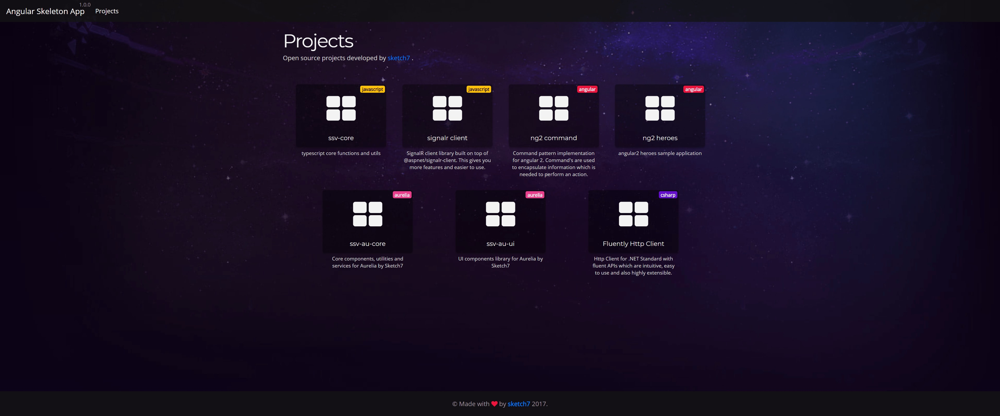

# Angular Skeleton App
Angular 6.x navigation skeleton project with styling which get you started faster.

## What does it have?
 - Angular CLI 6.0 template
 - SCSS for styling
 - Font Awesome and Bootstrap 4.x (no javascript, just styles)
 - Navigation/layout
 - Theming
 - Linting/formatting - prettier, tslint, eslint, stylelint
 - Circle CI 2 integration

 

 ## todo
  - SSR server
  - docker image

# Getting Started

## Start developing

Run `npm start` to start developing.

## Build and run production

Run `npm run start:prod` build and run for production.

# Angular CLI

This project was generated with [Angular CLI](https://github.com/angular/angular-cli) version 6.0.

## Development server

Run `ng serve` for a dev server. Navigate to `http://localhost:4200/`. The app will automatically reload if you change any of the source files.

## Code scaffolding

Run `ng generate component component-name` to generate a new component. You can also use `ng generate directive|pipe|service|class|guard|interface|enum|module`.

## Build

Run `ng build` to build the project. The build artifacts will be stored in the `dist/` directory. Use the `-prod` flag for a production build.

## Running unit tests

Run `ng test` to execute the unit tests via [Karma](https://karma-runner.github.io).

## Running end-to-end tests

Run `ng e2e` to execute the end-to-end tests via [Protractor](http://www.protractortest.org/).

## Further help

To get more help on the Angular CLI use `ng help` or go check out the [Angular CLI README](https://github.com/angular/angular-cli/blob/master/README.md).
